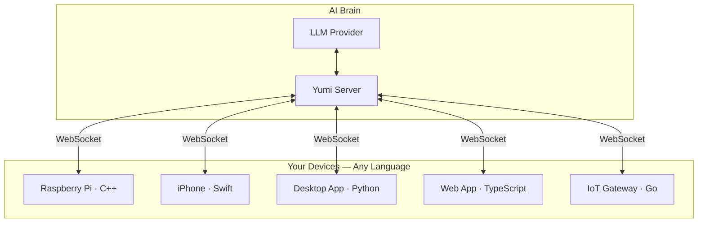

# Yumi

[](https://github.com/wenxijiao/yumi-agent/actions/workflows/ci.yml)
[](LICENSE)
[](https://www.python.org/downloads/)

**One API to let AI call functions in any language, on any device.**

Register a function. AI calls it. Python, Rust, Kotlin, Dart, C++, Swift, TypeScript, Go, Java, C# — same pattern everywhere.

> Status: alpha. The core workflows are usable today, but APIs, generated templates, and UX may still change as the project stabilizes.


## Quick Start

```bash
pip install yumi       # or, from source: git clone … && pip install .
yumi --server                # first run walks you through provider/model setup
yumi --demo                  # in another terminal: launches Smart Home + Planner
yumi --chat                  # ask AI to control them in natural language
```

Connect your own app:

```bash
cd my_project
yumi --edge --lang python    # also: typescript, swift, go, rust, kotlin, dart, java, csharp, cpp, ue5
```

`yumi --edge` scaffolds a `yumi_tools/` directory. Edit the generated setup file, call its init function from your app entry point, and your functions appear as AI tools. Full walkthrough in [Getting Started](docs/GETTING_STARTED.md).

## Demo

`yumi --demo` launches **two independent Python GUIs** at once:

- **Smart Home** — lights, TV, thermostat, coffee machine, locks (room cards + status)
- **Planner** — tkinter schedule app with a mini calendar and day timeline

Both windows are display-only. Open `yumi --chat` or `yumi --ui` and try:

> Turn on the kitchen lights and add a "Cook dinner" event at 18:00 for 1 hour, category personal.

The demo requires a graphical desktop session. On Linux, install Tk first (`sudo apt install python3-tk` on Debian/Ubuntu). More example prompts are in [Getting Started](docs/GETTING_STARTED.md#demo).

## Same pattern, every language

The flow is the same in every language: run `yumi --edge` → implement tools in any module you like → import them in the generated setup file, register them, and define `init_yumi` / `initYumi` → call that init function once from your app's entry point. There is no required folder layout; only the imports in setup need to reach your functions.

### Python

```python
# my_app/tools.py
def analyze_data(path: str) -> str:
    """Load a CSV and return a short summary."""
    return "summary"
```

```python
# yumi_tools/python/yumi_setup.py
from my_app.tools import analyze_data
from .yumi_sdk import YumiAgent

def init_yumi():
    agent = YumiAgent(edge_name="My Server")
    agent.register(analyze_data, "Analyze CSV at path and return a short summary")
    return agent

# Standalone script:  init_yumi().run()              (blocks until Ctrl+C)
# Embedded in an app: init_yumi().run_in_background() (returns immediately)
```

```python
# your app entry point
from yumi_tools.python.yumi_setup import init_yumi
init_yumi()
# … rest of your program …
```

If you embed Yumi inside an already-installed Python package, `from yumi.sdk import YumiAgent` works directly without the `yumi_tools/` tree.

### TypeScript

```typescript
// yumi_tools/typescript/yumiSetup.ts
import { YumiAgent } from "./yumi_sdk/src";
import { searchProducts } from "../src/catalog";

export function initYumi() {
  const agent = new YumiAgent({ edgeName: "My Web App" });
  agent.register({
    name: "searchProducts",
    description: "Search the product catalog",
    handler: async (args) => searchProducts(args.string("query") ?? ""),
  });
  agent.runInBackground();
  return agent;
}
```

### Other languages

C++, Swift, Go, Java, C#, Rust, Kotlin, Dart, and UE5 follow the same pattern with idiomatic syntax. See the [Edge Tools Guide](docs/EDGE_TOOLS.md) for full code samples in each language.

## How It Works



Your app connects to the Yumi server over WebSocket and registers functions as tools. The LLM sees them alongside server-side tools and calls whichever it needs. Results flow back through the same connection.

## Main Commands

| Command | What it does |
|---|---|
| `yumi --server` | Start the backend API server |
| `yumi --server --telegram` | Start the API and a Telegram bot together (same machine) |
| `yumi --telegram` | Run only the Telegram bot; connects to the API like `yumi --chat` |
| `yumi --server --discord` | Start the API and a Discord bot together (same machine) |
| `yumi --discord` | Run only the Discord bot; connects to the API like `yumi --chat` |
| `yumi --server --line` | Start the API and a LINE webhook sidecar (default port 8788) |
| `yumi --line` | Run only the LINE webhook server; core API must already be reachable |
| `yumi --server --voice` | Start the API with a microphone wake-word loop (say "hi yumi" to talk) |
| `yumi --speak "..."` | Synthesize text with the configured TTS and play it (smoke test) |
| `yumi --ui` | Start the web UI (chat, tools, settings) |
| `yumi --chat` | Start terminal chat |
| `yumi --edge` | Interactively scaffold an edge workspace in the current directory |
| `yumi --run-edge --lang python` | Run a generated standalone edge template |
| `yumi --demo` | Run the Smart Home + Planner (schedule) demo |
| `yumi --setup` | Reconfigure models and providers |
| `yumi --config` | Create/update `~/.yumi/config.json` with all known settings and defaults |
| `yumi --cleanup` | Delete all Yumi user data (`~/.yumi/`) |
| `yumi --cleanup-models` | Delete local model caches managed by Yumi (`~/.yumi/models/`) |
| `yumi --cleanup-models --include-ollama` | Also remove configured Ollama models |
| `yumi --cleanup-memory` | Delete saved chat memory and embeddings only |

## Optional Integrations

- **Telegram** — chat with Yumi from a Telegram bot. Get a token from [@BotFather](https://t.me/BotFather), then run `yumi --server --telegram` (single machine) or `yumi --telegram` (bot only). Token, allowlist, and timer-push details: [Configuration → Telegram](docs/CONFIGURATION.md#telegram).
- **Discord** — chat with Yumi from a Discord bot. Create an application + bot in the [Discord Developer Portal](https://discord.com/developers/applications), enable the Message Content intent, then run `yumi --server --discord` (single machine) or `yumi --discord` (bot only). Token, allowlist, and timer-push details: [Configuration → Discord](docs/CONFIGURATION.md#discord).
- **LINE** — chat from LINE via the Messaging API webhook. Run `yumi --server --line` (single machine, default port 8788) or `yumi --line` (webhook sidecar only). Credentials and webhook setup: [Configuration → LINE](docs/CONFIGURATION.md#line).
- **Voice** — talk to Yumi through your microphone. Say the wake word ("hi yumi") and Yumi transcribes the rest of your sentence and runs it as a chat turn. Transcription runs locally with Whisper, or with no model download through a cloud provider that reuses your existing key — `openai`, `gemini`, or `dashscope` (Qwen3-ASR). Coexists with Telegram / `--chat` / `--ui` so the same Yumi instance can listen and type at once, and recent voice/Telegram/CLI turns are merged into each prompt. Mic capture needs a Picovoice access key. Setup: [Configuration → Voice](docs/CONFIGURATION.md#voice).
- **Spoken replies (TTS)** — Yumi can talk back. Pick a backend in `yumi --setup`: `system` (Windows SAPI, macOS `say`, or Linux `espeak`), `openai` (OpenAI TTS, reuses your `openai_api_key`), `dashscope` (Qwen3-TTS via the DashScope API), or `qwen` (Qwen3-TTS run locally on a GPU via the optional `[tts-local]` extra). In voice mode replies are spoken automatically; on Telegram / Discord, `/voice on` (`!voice on`) switches a chat to audio replies. Test any time with `yumi --speak "hello"`.

## Supported Providers

| Provider | Chat | Embedding | Notes |
|---|---|---|---|
| Ollama | Yes | Yes | Local models, no API key needed |
| OpenAI | Yes | Yes | Also works with OpenAI-compatible endpoints via `openai_base_url` |
| Gemini | Yes | Yes | Google Gemini |
| FastEmbed | No | Yes | Local multilingual embeddings downloaded by `yumi --setup`; no Ollama needed |
| Claude | Yes | No | Anthropic Claude (use another provider for embeddings) |
| DeepSeek | Yes | No | OpenAI-compatible chat API; use FastEmbed, Ollama, OpenAI, or Gemini for embeddings |
| Grok | Yes | No | xAI Grok chat API; use FastEmbed, Ollama, OpenAI, or Gemini for embeddings |

You can mix providers — for example OpenAI for chat and Ollama for embeddings.

## Edge SDKs

| Language | Runtime | Install |
|---|---|---|
| Python | `websockets` | `pip install .` or `yumi --edge --lang python` |
| TypeScript | `ws` (Node) / native (browser) | `npm install yumi-sdk` or `yumi --edge --lang typescript` |
| C++ | CMake, IXWebSocket | `yumi --edge --lang cpp` |
| Swift | SwiftPM | `yumi --edge --lang swift` |
| Go | `gorilla/websocket` | `yumi --edge --lang go` |
| Java | JDK 11+ native WebSocket | `yumi --edge --lang java` |
| C# | .NET 6+ native WebSocket | `yumi --edge --lang csharp` |
| Rust | Tokio + `tokio-tungstenite` | `yumi --edge --lang rust` |
| Kotlin | OkHttp (JVM) | `yumi --edge --lang kotlin` |
| Dart | `web_socket_channel` (VM / Flutter) | `yumi --edge --lang dart` |
| UE5 | Unreal Engine module | `yumi --edge --lang ue5` |

## Documentation

| Document | Description |
|---|---|
| [Getting Started](docs/GETTING_STARTED.md) | Installation, first run, providers, UI, terminal chat |
| [Edge Tools Guide](docs/EDGE_TOOLS.md) | Connect your app, device, or game as an edge tool host |
| [Tool Registration](docs/TOOL_REGISTRATION.md) | All tool registration parameters, confirmation, proactive options |
| [Configuration](docs/CONFIGURATION.md) | `~/.yumi/config.json`, environment variables, Telegram, Discord, LINE, Docker |
| [Deployment](docs/DEPLOYMENT.md) | Install, first run, Docker, production notes (TLS, CORS, health checks) |
| [Architecture](docs/ARCHITECTURE.md) | System design, plugin ports, API stability |
| [HTTP API](docs/HTTP_API.md) | Chat NDJSON stream, all routes, curl examples |
| [Memory](docs/MEMORY.md) | Session history and LanceDB embeddings |
| [Testing](docs/TESTING.md) | Running and writing tests |

## How Yumi Differs

Yumi is **not** another Python-only LLM chaining library. It ships a runnable server, terminal UI, and web UI, plus **first-class edge tool hosts** across eleven languages. The focus is on **device-side tool execution**: your game, phone app, IoT sensor, or desktop program exposes functions, and the AI calls them directly in your process.

## Core Scope

This package (`yumi`) is the **open-source, self-hosted core** — run your own server at home. You chat with it remotely through **Telegram, LINE, or Discord** bridges, while edge devices register tools on the **same machine or your LAN**. No account scoping, no quotas — a complete single-user agent on your own hardware.

Use it locally through the terminal chat or web UI, connect messaging bridges when you want remote chat, and add your own apps/devices through Edge SDKs. The API is local-first and single-user by default, so keep it on localhost or a trusted network unless you put your own access controls in front.

## License

Apache License 2.0 — see [LICENSE](LICENSE) and [NOTICE](NOTICE).

[Contributing](CONTRIBUTING.md) · [Security](SECURITY.md) · [Changelog](CHANGELOG.md) · [Code of Conduct](CODE_OF_CONDUCT.md)
