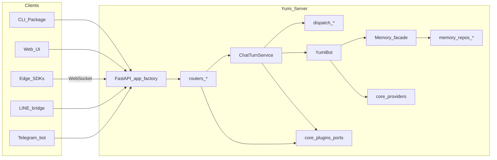

# Architecture

## Overview



Yumi is **local-first**: it ships a runnable server, terminal UI, Reflex web UI, and first-class edge-tool hosts so your game, app, or device can expose tools from its own process. The same FastAPI app accepts traffic from local clients (loopback HTTP) and the LINE/Telegram bridges.

## Module Layout (platform / features / api)

`yumi/core/` is organized as a deliberate hybrid — infrastructure by layer,
business capabilities by feature:

```
yumi/core/
  platform/     cross-cutting infrastructure (no feature knowledge)
                runtime/ dispatch/ providers/ streaming/ plugins/
                tools/ security/ http/  exceptions.py  env_load.py
  features/     self-contained capabilities; each owns its router + service + domain
                chat/ memory/ proactive/ config/ stt/ prompts/
                uploads/ edge/ tools/ monitor/ health/
  api/          HTTP composition root (app_factory, __main__) — wires features
                onto the FastAPI app; may import both platform and features
  chatbot.py    central YumiBot composition object
```

**Dependency rule (enforced):**

* `features/*` depend on `platform/*`, **never** the reverse.
* `features/*` do **not** import each other; shared needs go through `platform`.
* `api/` (the composition root) may import both `platform` and `features`.
* `platform/` has **no import-time dependency on features** — the few residual
  needs (config + embeddings in tool routing; the default memory/bot
  factories) are deferred via lazy default-wiring through the plugin ports.

To understand or delete one capability, look in one folder: e.g. everything for
chat lives in `features/chat/` (`router.py` → `pipeline.py` → `service.py`,
plus `context.py`, `debug_trace.py`, `trace_sink.py`).

> **Note on legacy import paths.** Modules were relocated here from a flatter
> `yumi/core/` layout. The old paths were **removed** — there are no
> compatibility shims, so importing an old path now raises `ModuleNotFoundError`.
> See [`MIGRATION_PLATFORM_FEATURES.md`](MIGRATION_PLATFORM_FEATURES.md) for the
> full old→new map.

## Web UI direction

The current web UI (`yumi/ui/`) is built with Reflex (Python→React). It talks to
the server **only** over the HTTP/NDJSON API (no in-process imports of core), so
the recommended direction is to migrate it to a standalone React app: that
decouples UI releases from the Python package, removes Reflex from the
`pip install yumi-agent` dependency surface, and lets the UI ship as a static
artifact. `yumi/ui/` is otherwise frozen pending that migration.

## HTTP Entry Layer

`yumi/core/api/app_factory.py` is the single source of truth for HTTP composition. It owns:

* Process lifespan (`init_yumi`, model-config preflight, bot warm-up, signal handlers, proactive-message service).
* CORS, docs-access middleware, and any middleware contributed by the [`MiddlewareExtender`](#plugin-ports) plugin port.
* Mounting every resource router. Each feature owns its router at `yumi/core/features/<feature>/router.py`:

  | Router | Resource |
  |---|---|
  | `features/chat/router.py` | `POST /chat` (NDJSON streaming), `POST /clear`, `PUT/GET /config/chat-debug` |
  | `features/config/router.py` | `GET/PUT /config/{model,system-prompt,session-prompt,ui}` |
  | `features/edge/router.py` | `WS /ws/edge` |
  | `features/health/router.py` | `GET /health` |
  | `features/memory/router.py` | sessions and messages CRUD |
  | `features/monitor/router.py` | `GET /monitor/{topology,traces}` |
  | `features/stt/router.py` | `POST /stt/transcribe` |
  | `features/proactive/router.py` | `GET /timer-events` (NDJSON) |
  | `features/tools/router.py` | tool listing and confirmation policy |
  | `features/uploads/router.py` | `POST /uploads` |

There are no compatibility shims or `sys.modules` indirection; adding a new endpoint is a one-router edit.

## Chat Turn Pipeline

`POST /chat` flows through five well-separated layers:

```
features/chat/router.py   — quota check + audit + StreamingResponse envelope
features/chat/pipeline.py — facade: yields wire-format dicts (legacy contract)
features/chat/service.py  — ChatTurnService orchestrator (~400 lines, state machine)
platform/dispatch/*       — domain pipeline (one collaborator per concern)
platform/runtime/*        — mutable state registries (locks, edge peers, tool policy, ...)
```

`ChatTurnService.stream_chat_turn` is a small state machine; every per-turn concern lives in `platform/dispatch/`:

| Module | Responsibility |
|---|---|
| `dispatch/context.py` | `TurnContext` value object, `ToolInvocation`, `ToolResult` |
| `dispatch/usage.py` | `UsageRecorder` context manager — token totals + quota persistence |
| `dispatch/normalizer.py` | `ToolCallNormalizer` — model-emit normalisation + retry budget |
| `dispatch/confirmation.py` | `ConfirmationGate` — user confirmation flow + always-allow persistence |
| `dispatch/local.py` | `LocalToolExecutor` — registered local tool runner with timeout |
| `dispatch/edge.py` | `EdgeToolExecutor` — WebSocket RPC to an edge peer |
| `dispatch/dispatcher.py` | `ToolDispatcher` — argument parsing, classification, parallel run |

Debug-trace recording and diagnostic file writes live alongside the orchestrator in
`features/chat/trace_sink.py` (`ChatTraceSink`).

The orchestrator yields `ChatEvent` model instances (see below); the `features/chat/pipeline.py` facade serialises them to dicts at the public boundary so existing dict-shaped consumers (LINE bridge, timer callback, SDK clients) keep working unchanged.

## Chat Event Protocol

The `/chat` NDJSON stream is a **discriminated Pydantic union** keyed by `type` (`yumi/core/platform/http/events.py`):

```python
ChatEvent = Annotated[
    Union[TextEvent, ThoughtEvent, ToolStatusEvent, ToolConfirmationEvent, ErrorEvent],
    Field(discriminator="type"),
]
```

The wire format is unchanged — `model_dump()` produces the same JSON the legacy code did — but producers and consumers can opt into typed dispatch via `parse_chat_event()` and `serialize_chat_event()`. Adding a new event type is one model + one `case` in `yumi/core/platform/http/stream_consumer.py`; every existing channel adapter inherits a no-op default until it explicitly opts in.

## Channel Adapters

Channel-specific rendering (LINE, Telegram, terminal CLI, future Discord/Slack/WhatsApp) implements the `ChannelHandler` Protocol from `yumi/core/platform/http/stream_consumer.py`:

```python
class ChannelHandler(Protocol):
    async def on_text(self, event: TextEvent) -> None: ...
    async def on_thought(self, event: ThoughtEvent) -> None: ...
    async def on_tool_status(self, event: ToolStatusEvent) -> None: ...
    async def on_tool_confirmation(self, event: ToolConfirmationEvent) -> None: ...
    async def on_error(self, event: ErrorEvent) -> None: ...
```

`consume_chat_stream(stream, handler)` iterates a chat stream and dispatches each event to the right handler method. Concrete handlers (`_LineChatHandler`, `_TelegramChatHandler`) implement only the methods they care about and inherit no-op defaults from `BaseChannelHandler`. New channels are typically a 5-method handler plus a thin entry-point function.

## Memory Layer

`yumi/core/features/memory/` exposes a single public class — `Memory` — which is a **façade** over focused collaborators:

```
memory/
├── memory.py              # Memory façade (delegates to the collaborators below)
├── backend.py             # LanceDBBackend: connection cache, table helpers, time/SQL primitives
├── embedding_runner.py    # EmbeddingProcessor: dim migration + background re-embed
└── repos/
    ├── messages.py        # MessageRepository (chat_history)
    ├── sessions.py        # SessionRepository (chat_sessions)
    ├── long_term.py       # LongTermMemoryRepository (long_term_memories)
    ├── observations.py    # ToolObservationRepository (tool_observations)
    └── summaries.py       # SessionSummaryRepository (session_summaries)
```

`Memory(...)` keeps its historical signature and every public method (`add_message`, `create_message`, `list_sessions`, …); each one delegates to the appropriate repository. Legacy private helpers (`_has_table`, `_open_table`, `_build_where_clause`, …) are preserved as instance methods so external collaborators (`memories/context.py`, `memories/storage.py`, `memories/writer.py`, plugin memory factories) keep functioning unchanged.

The split exists so alternate storage backends can implement the same Repository surface without rewriting the façade. See [`MEMORY.md`](MEMORY.md) for the on-disk layout and retrieval semantics.

## CLI

The CLI is a **Command Pattern + Registry** in `yumi/cli/`:

| File | Responsibility |
|---|---|
| `cli/__init__.py` | `main()` entry point (~30 lines) plus the `run_*` helper functions each command calls |
| `cli/registry.py` | `Command` ABC + `CommandRegistry` |
| `cli/commands.py` | One `Command` subclass per sub-command, plus `validate_cross_command_flags` |

`main()` builds the default registry, mounts each command's argparse flags, runs cross-command validation, then dispatches. Adding a sub-command is one `Command` subclass + one `registry.add(...)` line — no four-place edit. Optional plugins can inject extra sub-commands via the [`AdminCli`](#plugin-ports) plugin port without changing the core CLI.

## Server-Side Tools

Server-side tools are Python functions decorated with `@yumi_tool` in `yumi/tools/`. They are loaded at startup via `load_tools_from_directory()` and stored in `TOOL_REGISTRY`. SDK wiring for your project typically lives in a `bootstrap` module (e.g. `yumi/tools/bootstrap.py`) that calls `init_yumi()`.

## Edge Tools

Edge tools are registered by remote clients over WebSocket at `/ws/edge`. Each client sends a `register` message with tool schemas on connect. The server prefixes tool names with the edge name and stores them in `EDGE_TOOLS_REGISTRY`.

Core server tools are loaded into every model request when enabled. Edge tools are routed dynamically: for each chat turn, Yumi builds retrieval documents from the Edge name, aliases, tool name, description, and parameter descriptions, embeds them with the configured embedding model, and sends only the most relevant Edge tool schemas to the provider (default: 20). This keeps the model-facing tool set small even when many Edge processes register hundreds of functions.

When the LLM selects an edge tool, `EdgeToolExecutor` sends a `tool_call` message to the relevant client. The client executes the function and returns a `tool_result`. Cancellation, timeout, and disconnection are handled inside the executor; the orchestrator never sees raw WebSocket frames.

## Plugin Ports

`yumi/core/platform/plugins/ports.py` declares the protocols optional plugins can implement. The core MUST only depend on these abstractions and never import plugin packages directly.

| Port | Core default | Optional plugin |
|---|---|---|
| `IdentityProvider` | local synthetic user | authenticated identity |
| `QuotaPolicy` | no-op | usage policy |
| `BillingHook` | returns 0.0 | cost estimator |
| `SessionScope` | identity transparent | scoped sessions |
| `BotPool` | shared singleton | scoped bot pool |
| `MemoryFactory` | `SharedMemoryFactory` | scoped/alternate memory |
| `EdgeScope` | name = key | scoped edge tools |
| `AuditSink` | log only | persistent audit sink |
| `RouteExtender` | none | mounts additional routes |
| `MiddlewareExtender` | none | adds middleware |
| `AdminCli` | none | injects extra sub-commands |

## Admin API

Yumi exposes a local admin API for configuration, tools, and memory.

| Method | Endpoint | Purpose |
|---|---|---|
| `GET` | `/config/model` | Read current model config |
| `PUT` | `/config/model` | Update provider/model |
| `GET` | `/tools` | List server and edge tools |
| `POST` | `/tools/toggle` | Enable or disable a tool |
| `GET` | `/memory/search` | Search memory |

For HTTP details (chat NDJSON stream, curl examples), see [HTTP_API.md](HTTP_API.md).

## Public API Stability

Yumi is in the **0.x** stage. The interfaces intended for users to build on are:

- The `yumi` CLI (sub-commands and flags documented in `yumi --help`).
- The documented HTTP routes in [HTTP_API.md](HTTP_API.md).
- The `ChatEvent` schema in `yumi/core/platform/http/events.py` and the `ChannelHandler` protocol in `yumi/core/platform/http/stream_consumer.py` (for non-Python channel adapters or external SDK clients that want typed events).
- The SDKs and templates under [`yumi/sdk/`](../yumi/sdk/README.md) and `yumi --edge`.

Internal Python modules such as `yumi.core.platform.dispatch.*`, `yumi.core.features.memory.repos.*`, and `yumi.core.features.*.router` are implementation details and may change between releases. Breaking changes to user-facing surfaces are called out in the changelog and release notes.
